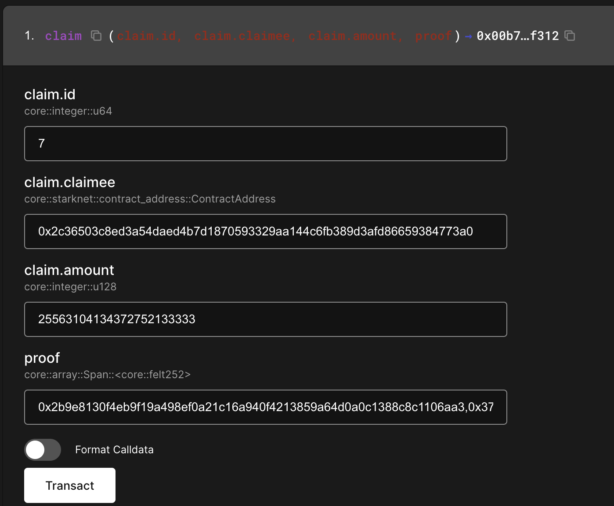

# EKUBO token

The EKUBO token is an [L1 Ethereum token](https://etherscan.io/token/0x04C46E830Bb56ce22735d5d8Fc9CB90309317d0f) bridged to [Starknet](https://voyager.online/token/0x075afe6402ad5a5c20dd25e10ec3b3986acaa647b77e4ae24b0cbc9a54a27a87), developed for the purpose of decentralizing ownership of Ekubo Protocol.

## Initial distribution

The total supply of the EKUBO token is 10 million (`10,000,000`). The total supply was split into 3 equal parts of `3,333,333` tokens. The 3 categories of distribution for the EKUBO token generation event were:

* **Airdrop**: 1/3rd of the total supply was distributed to users via airdrop
* **Team**: 1/3rd of the total supply is held by the company Ekubo, Inc.
* **Sale**: 1/3rd of the total supply was sold by the DAO for ETH, USDC and STRK via Ekubo's DCA order feature

### Airdrop

Each user's allocation of EKUBO was calculated based on their share of total points on the leaderboard, with a few adjustments: we exponentiated each user's points (i.e. `p^x`) based on their role in the ecosystem, and accounts that earned less than 1,000 points were excluded. As a result, users who used fewer accounts received slightly more EKUBO tokens from the airdrop.

* Moderators had a boost of `1.01`
* Active translators received a boost of `1.001`
* Everyone else received a boost of `1.0001`

The airdrop contract is deployed at the address `0x04bfacd0fcf70f444815de9150008fd12b5fb6721562707e502ce71ccb327d88` ([Starkscan](https://starkscan.co/contract/0x04bfacd0fcf70f444815de9150008fd12b5fb6721562707e502ce71ccb327d88), [Voyager](https://voyager.online/contract/0x04bfacd0fcf70f444815de9150008fd12b5fb6721562707e502ce71ccb327d88)). It uses the open source airdrop contract found [here](https://github.com/EkuboProtocol/governance/releases/tag/v2.2.1). There is no deadline to claim the airdrop.

An airdrop can be claimed by using a block explorer to submit a transaction using data found in this spreadsheet:


A CSV containing the entirety of the merkle tree for the EKUBO airdrop


#### Claiming your airdrop

You may claim your airdrop from the [app](https://app.ekubo.org/rewards), or use this guide to claim it directly from a block explorer.



#### Download the airdrop data CSV file

This CSV contains a list of all the accounts and allocation amounts that were included in the airdrop. Each row corrresponds to a single address's claim in the airdrop.



#### Find your address in the CSV file

Extract the `.csv` from the `.zip` file , and then open the file in any text editor like Notepad or Sublime. Search for the line containing your address in the file. If you cannot find it, make sure to remove any leading zeroes from your address. E.g. if your address is `0x0000abcd`, search for `0xabcd`.  If you still cannot find your address, you did not receive an airdrop.


Do not use Excel or Numbers to open the spreadsheet. They will round the numbers in the columns causing you to get "Invalid proof" when you try to submit your transaction.




#### Copy the row into Voyager block explorer

The columns in the CSV are claimee, id, amount and proof from left to right. For the row containing your address, copy each column value into the [block explorer](https://voyager.online/contract/0x04bfacd0fcf70f444815de9150008fd12b5fb6721562707e502ce71ccb327d88#writeContract). Remove the quotes and curly braces from the `proof` column data. Then connect your wallet and it should look something like this.




#### Click transact to claim!

When you click transact, the transaction should simulate successfully, and if you are transacting from the `claimee` address you should see an EKUBO balance increase from the simulation.



### Sale

The DCA orders executed over 2 months, starting 5/24/24, 2:48 AM UTC and ending 7/23/24, 7:09 PM. The proceeds of the DCA order were owned by the [Governor ](https://voyager.online/contract/0x053499f7aa2706395060fe72d00388803fb2dcc111429891ad7b2d9dcea29acd), a.k.a. the DAO.

The following pools were used: [EKUBO/ETH 5%](https://app.ekubo.org/positions/new?poolType=twamm\&quoteCurrency=ETH\&baseCurrency=EKUBO\&fee=17014118346046923173168730371588410570\&poolOnly=true), [EKUBO/STRK 5%](https://app.ekubo.org/positions/new?poolType=twamm\&quoteCurrency=STRK\&baseCurrency=EKUBO\&fee=17014118346046923173168730371588410570\&poolOnly=true), and [EKUBO/USDC 5%](https://app.ekubo.org/positions/new?poolType=twamm\&quoteCurrency=USDC\&baseCurrency=EKUBO\&fee=17014118346046923173168730371588410570\&poolOnly=true).

Approximately `3,269,920` EKUBO was sold for `343.675` ETH, `1,204,770` USDC, and `1,549,920` STRK.

### Team

The company Ekubo, Inc., a service provider to the DAO, holds one-third of the total supply. There is no vesting schedule for these tokens. The team has come to an agreement with the DAO to hold these tokens indefinitely via [governance proposal](https://app.ekubo.org/governance/proposals/0x1bfc2ccdd2f9a718c45a9aa3a88770435f5272fbfeeb38ca2b3ad54c51c81e9) to fund the company's provision of services to the DAO.

## Value accrual

As of August 2025, the DAO currently holds total ownership of Ekubo Protocol smart contracts, meaning it can upgrade the contracts on Starknet, and collect revenue on EVM and Starknet. Note there is no upgrade mechanism for EVM contracts.

It is the right and responsibility of the DAO to decide what to do with the revenue. The DAO may direct protocol revenue towards EKUBO buybacks, and then may further direct that EKUBO to active participants in the protocol, such as governance stakers or liquidity providers.

As of  August 2025, the position of Ekubo, Inc. is that the revenue should be directed towards growth of the protocol, and we will vote accordingly until the protocol achieves sustainable revenue, i.e. the revenue earned by the protocol exceeds the total costs to keep the protocol running.

The team allocation of EKUBO tokens is entirely held by Ekubo, Inc., and the company is committed to maintaining its share of Ekubo Protocol. The end-goal is for Ekubo, Inc. to be sustained by protocol revenue that is directed towards token holders. This aligns the equity holders with the interests of the protocol. The vision is further described in the [alignment proposal](https://app.ekubo.org/governance/proposals/0x1bfc2ccdd2f9a718c45a9aa3a88770435f5272fbfeeb38ca2b3ad54c51c81e9).

## Governance contracts

The governance contract addresses can be found [here](../../integration-guides/reference/contract-addresses.md#governance-contracts).

You can learn more about how the governance contracts work [here](./).

## Disclaimer

The EKUBO token serves only to decentralize the ownership role of the on-chain instance of the core Ekubo Protocol.

Ekubo, Inc., is not in any way obligated to provide service, maintenance, or development for Ekubo Protocol and related tools or services except as explicitly agreed via governance proposal.

The governance infrastructure is necessary security infrastructure: it protects users of Ekubo Protocol from malicious upgrades by requiring a decentralized and interested majority of stakeholders to come to consensus on the validity and safety of the changes.

